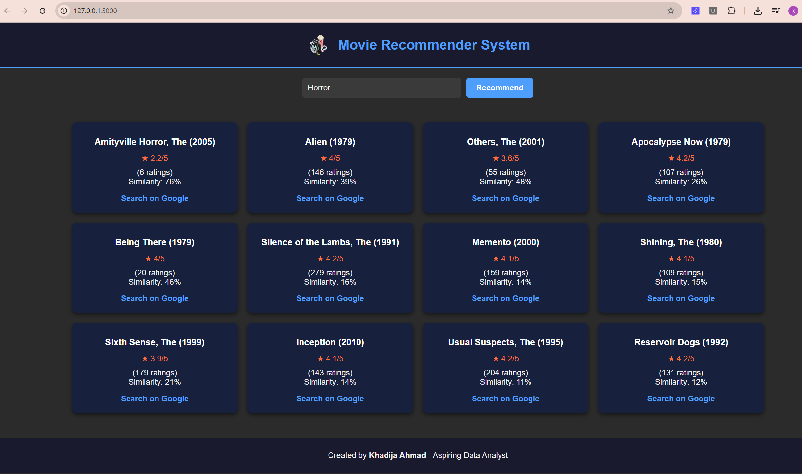

# Movie Recommender System

## Description

The **Movie Recommender System** is a web-based application that provides personalized movie recommendations based on user input. Users can search for a movie, and the system will suggest similar movies along with their ratings, similarity scores, and links for further exploration. The application is designed with a modern, Netflix-inspired interface for an engaging user experience.

## Features

- **Search Functionality**: Enter a movie name to get recommendations.
- **Movie Recommendations**: Displays a list of similar movies with:
  - Ratings (out of 5 stars).
  - Number of user ratings.
  - Similarity percentage.
- **Interactive Design**: Modern, responsive UI with a dark theme and vibrant accent colors.
- **External Links**: Quick access to search results for recommended movies.

## Technologies Used

- **Frontend**: HTML, CSS (Netflix-inspired design).
- **Backend**: Flask (Python).
- **Data**: Movie recommendation logic (e.g., collaborative filtering or content-based filtering).

## Installation

1. Clone the repository:
   ```bash
   git clone https://github.com/your-username/movie_recommender.git
   ```
2. Navigate to the project directory:
   ```bash
   cd movie_recommender
   ```
3. Install the required Python packages:
   ```bash
   pip install -r requirements.txt
   ```
4. Run the application:
   ```bash
   python app.py
   ```
5. Open your browser and go to `http://127.0.0.1:5000`.

## Usage

1. Enter the name of a movie in the search bar.
2. Click the "Recommend" button or press Enter.
3. View the list of recommended movies with their details.
4. Click on the links to explore more about the movies.

## Screenshots

### Home Page


### Recommendations


### Google Search


## Contributing

Contributions are welcome! Please follow these steps:

1. Fork the repository.
2. Create a new branch:
   ```bash
   git checkout -b feature-name
   ```
3. Commit your changes:
   ```bash
   git commit -m "Add feature-name"
   ```
4. Push to the branch:
   ```bash
   git push origin feature-name
   ```
5. Open a pull request.

## License

This project is licensed under the MIT License. See the [LICENSE](LICENSE) file for details.

## Acknowledgments

- Inspired by Netflix's modern UI design.
- Built with Flask and love for movies.
- Created by **Khadija Ahmad** - Aspiring Data Analyst.